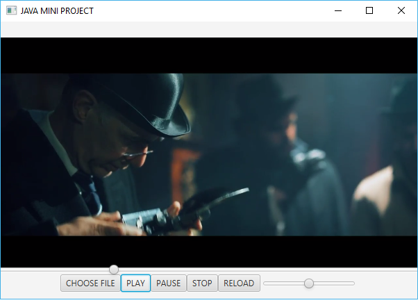
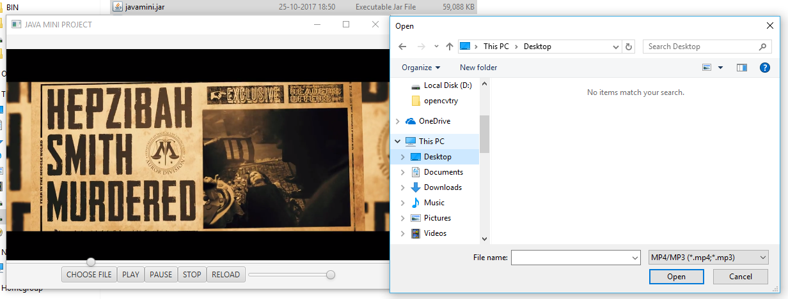

## OOPM-MINI-PROJECT : Basic Mediaplayer using JavaFX Framework

###### Features:

* Platform Independent
* MP3/MP4 Files Support
* Control Features : Play, Pause, Reload, Stop
* Volume Control
* Audio/Video Progress Control
* File Chooser

###### Screenshots:

